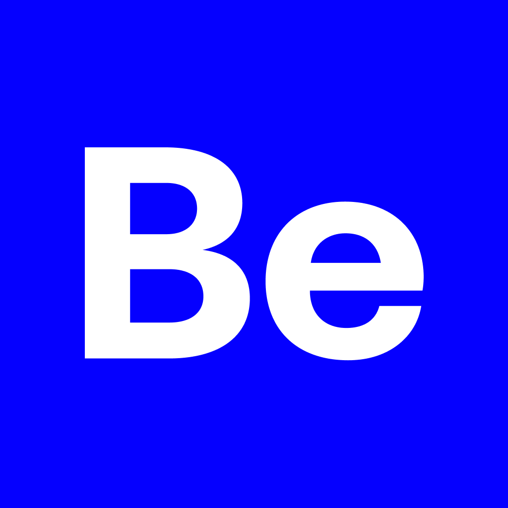

<p align="center">

</p>

# BeTalent Mobile

## Sobre o Projeto

Desenvolvido o projeto **BeTalent**, um aplicativo mobile com React Native e Expo que permite a consulta de funcionários e suas informações detalhadas. Ele utiliza uma API para fornecer os dados.

## Pré-requisitos

Para rodar o projeto, você precisará:

- **[git](https://git-scm.com/)**
- **[Node.js](https://nodejs.org/en)**
- Um dispositivo físico com o aplicativo **Expo Go** ou um emulador configurado (Android/iOS).

## Instruções para Rodar a Aplicação

Clone o repositório:

```bash
git clone https://github.com/VagnerNerves/betalent-mobile.git
```

### Back-end

Entre no diretório do back-end

```bash
  cd betalent-mobile\backend
```

Instale as dependências

```bash
  npm install
```

Inicie o back-end

```bash
  npm run start
```

### Mobile

Entre no diretório do mobile

```bash
  cd betalent-mobile\mobile
```

Instale as dependências

```bash
  npm install
```

Crie um arquivo .env baseado no arquivo .env.example.
Neste arquivo, defina a URL da API, colocando o IP da sua máquina para que o emulador consiga acessar a API.

Inicie o mobile

```bash
  npx expo start
```

## ✒ Author

<p align="center">
  

  <h3 align="center">Vagner Nerves</h3>
  
  <p align="center">  
    Made with love and hate 😅, get in touch!
  </p>
</p>  
  
<div align="center">

[](https://www.linkedin.com/in/vagnernervessantos/)
[](mailto:vagnernervessantos@gmail.com)
[](https://github.com/VagnerNerves)

</div>
